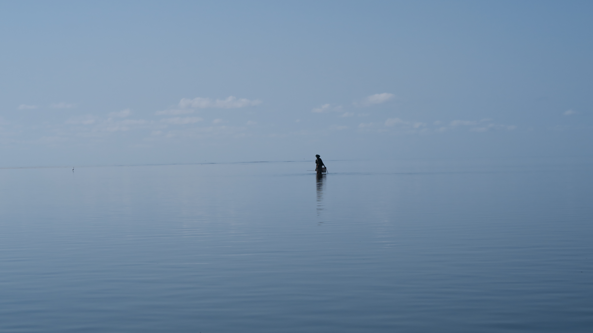

# South Africa

:::: {style="display: grid; grid-template-columns: 100% 40%; grid-column-gap: 1%; "}
::: {}
{width=100%}
:::

::: {}
Parklands, Cape Town.

May 2018.
:::
::::

# Moçambique

:::: {style="display: grid; grid-template-columns: 100% 30%; grid-column-gap: 1%; "}
::: {}
{width=100%}
:::

::: {}
Parque Nacional das Quirimbas.

August 2016.
:::

::: {}
{width=100%}
:::

::: {}
Parque Nacional das Quirimbas.

August 2016.
:::
::::

# United States

:::: {style="display: grid; grid-template-columns: 100% 30%; grid-column-gap: 1%; "}
::: {}
{width=100%}
:::

::: {}
New Orleans.

April 2018.
:::

::::